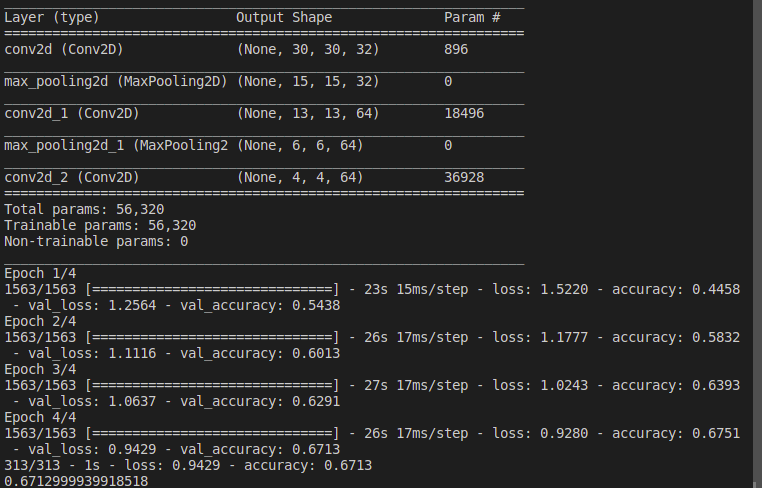
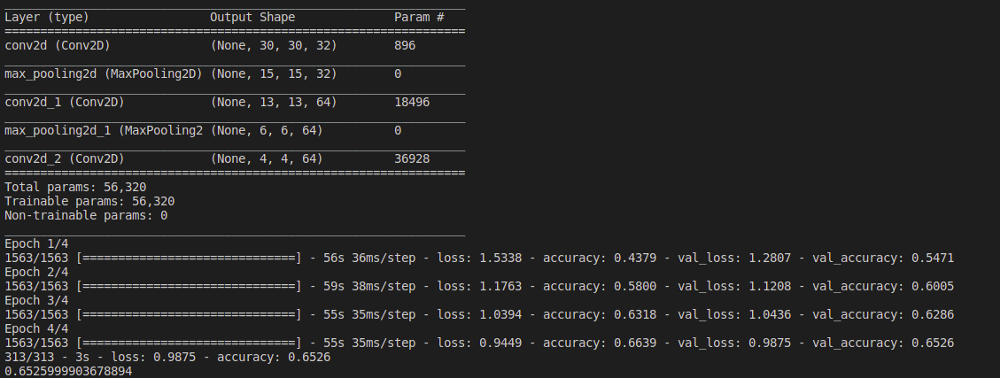

# DeepCompVision

This program uses Convolutional Neural Network to detect patterns locally to identify local shapes to differentiate and categorize images into specific labels. 

It imports the dataset from keras and then noramlize them to get the values between 0 and 1. Then the data is separated into training dataset to train the model and testing datatset to test the accuracy of the model.

As the dataset is small I decided to use Data Augmentation to make 4 copies ofeach image to increase the training dataset. To boost the data augmentation process, Multiprocessing is used where the workload is divided among 4 processes.

## Model
### Layer 1
The data's input shape is 32, 32, 3, and 32 filters of size 3x3 will be applied to it. For each convolution operation's output, we will also apply the activation function relu.

### Layer 2
Using 2x2 samples and a stride of 2, this layer will carry out the max pooling operation.

### Other Layers
Although they use the feature map from the preceding layer as input, the following set of layers perform very similar tasks. Additionally, they increase filter frequency from 32 to 64. We are able to do this because our data shrank in spatial dimensions as it moved through the layers, which allows us to add more depth without incurring computational costs.

# How to run

1. Clone Repo
2. Install tensorflow v2.2.0 by running on terminal
```
pip install tensorflow==2.2.0
```
3. Run the program
```
python DPL.py
```

# Results
## Without Data Augmentation


Accuracy = 67.13%

## With Data Augmentation


Accuracy = 65.26%

Clearly the accuracy after data augmentation is lesser than that of the model with data augmentation. This may be due to overfitting of data on the model making it inaccurate. Therefore, as a future improvement, pretrained model can be used to leverage its vast training.